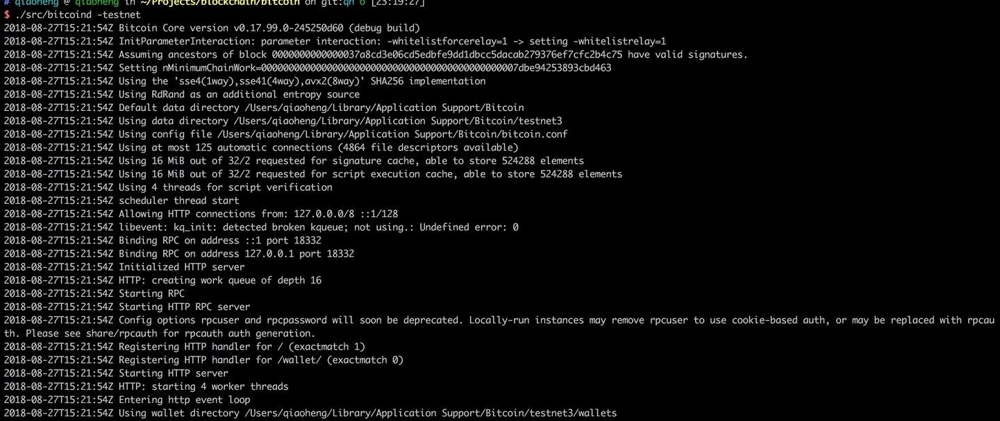

#   从源代码编译比特币

##写在开始之前，为什么你一定要学习区块链技术？

技术的变革和迭代一直在飞速发展中，作为有着15年程序开发经验的我，常常在思考现在的我们到底改如何做，到底应该学习些什么，才能跟上新的时代变革，保持自身的竞争力，并且能为这个世界带来更好的改变呢？

答案是，学习新技术，成为紧跟时代发展趋势的稀缺技术人才。而毫无疑问，比特币区块链技术是绝对不容错过的。

当我研究了比特币区块链之后，更加确信了这一点。比特币区块链技术解决了人和人之间的信任问题，是对生产力和生产关系的一次变革，而这必将影响人类社会的发展。

想到就要做到，于是我开始深入研究了比特币区块链技术，从0开始一行行的代码跑起来，遇到过很多坑，花了很多时间和精力爬坑。现在我把这些凝聚时间和心血的学习资料整理成文档写成教程，希望能够帮助你在学习的过程中少些弯路。

##准备工作

没有亲自跑一遍代码，不算真正的学习。

今天我们开始从零编译比特币源代码。

####下载比特币源代码

首先要做的就是从[github](https://github.com/bitcoin/bitcoin)上下载比特币的源代码，其中 `doc` 目录为比特币文档，`src` 为系统源代码，`test` 为测试代码的目录。具体怎么下载，想必大家都用过 `git` 和 `github` ，就不用我细说了。

当我们下载完源代码之后，进入 `doc` 子目录，找到 build-xxx.md 文档，xxx 代表了不同的系统，当前支持的系统有 freebas、netbsd、openbsd、osx、unix、windows 等，根据你的系统参考不同的安装文档。比如，我的系统为 Mac，对应的就是 build-osx.md，打开这个文档会看到构建说明和一些备注。

####命令行工具准备

在 Mac 系统下，必备的工具就是 `xcode` 命令行工具，我们通过输入如下命令进行安装：

    xcode-select --install

当弹出窗口出现时，选择 `安装`。

####安装依赖

当命令行工具安装之后，接下来我们要做的就是安装依赖，在些特别推荐使用[Homebrew](https://brew.sh/)，这是 Mac 下面安装应用的必备神器。

当 Homebrew 安装完成之后，就开始安装编译比特币的各种依赖了，命令如下：

    brew install automake berkeley-db4 libtool boost miniupnpc openssl pkg-config protobuf python qt libevent qrencode 

如果你需要生成 `dmg` 可执行文件，那么还需要 RSVG，安装命令如下：

    brew install librsvg

如果需要 ZMQ，那么还需要相关的库，安装命令如下：

    brew install zmq

## 具体步骤

当依赖安装完成之后，就真正开始编译比特币。

1.  **首先，进入比特币根目录。命令如下：**

        cd bitcoin

2.  **然后，开始编译比特币源代码。命令如下：**

        ./autogen.sh
        ./configure --enable-debug
        make clean && make -j4

    如果在编译过程中，出现如下错误：

        ld: symbol(s) not found for architecture x86_64
        clang: error: linker command failed with exit code 1 (use -v to see invocation)
        make[2]: *** [bitcoind] Error 1
        make[1]: *** [all-recursive] Error 1
        make: *** [all-recursive] Error 1

    那么需要明确指定 Boost 位置：

        ./configure --enable-debug --with-boost=/usr/local/opt/boost
    
    如果你不需要图形界面，那么在执行 `./configure` 时需要加入 `--without-gui` 标志，即 `./configure --without-gui`。另外，在 Mac 系统下，为了调试比特币代码，需要把 `configure` 文件中的所有 `-g -O2` 替换为 `-g`，这是因为 Mac 下的 LLDB 存在 bug，导致某些变量不可用。

    当你看到下面的图片时，恭喜你编译成功了。

    

    比特币编译成功时，会在 src 目录下面生成4个可执行的命令：bitcoind、bitcoin-cli、bitcoin-tx、qt/bitcoin-qt，如红框所示。

3.  **强烈建议，你执行下面的命令来运行一遍单元测试：**

        make check

    通常这一步是不会出错的。

4.  **可选地，你也可以生成一个 dmg，命令如下：**

        make deploy

    执行这个命令后，系统会提示你把应用放在 Application 下面。最终应用安装在 `/Applications/Bitcoin-Qt.app` 下。

当比特币编译完成后，万事大吉，只欠运行了。

5. **设置下 RPC用户及密码**

但是在运行比特币核心客户端之前，强烈建议你设置下 RPC用户及密码，这样你才可使用系统提供的所有 RPC 命令。

具体命令如下：

    echo -e "rpcuser=bitcoinrpc\nrpcpassword=$(xxd -l 16 -p /dev/urandom)" > "/Users/${USER}/Library/Application Support/Bitcoin/bitcoin.conf"
    
    chmod 600 "/Users/${USER}/Library/Application Support/Bitcoin/bitcoin.conf"

执行完上面两个命令之后，我们来确认是否设置成功。

首先执行：

 `ls -l "/Users/${USER}/Library/Application Support/Bitcoin/bitcoin.conf"` 

来确认文件的模式为 `-rw-r--r—`，如图下图：

然后再执行`vi "/Users/${USER}/Library/Application Support/Bitcoin/bitcoin.conf"`

看到文件内容如下即为设置成功。

当设置完 RPC 用户及密码之后，下面就开始输入最最重要的命令：

    ./src/bitcoind -testnet     # -testnet 代表的是测试网络，如果不加这个标志，那么就连接到比特币主网络。作为演示，此处连接到比特币测试网络。

键入上面的命令并按下回车键。

恭喜你，你的比特币之路已经开始。

我是区小白，区块链开发者，区块链技术爱好者，深入研究比特币,以太坊,EOS Dash,Rsk,Java, Nodejs,PHP,Python,C++ 现为Ulord全球社区联盟（优得社区）核心开发者。

我希望能聚集更多区块链开发者，一起学习共同进步。

敬请期待下一篇文章：如何启动比特币系统并加入比特币网络 

学习过程中如有遇到任何问题，以及想要学习更多内容请加

QQ群：253968045

QQ号：77078193 或者 705706498

微信：joepeak