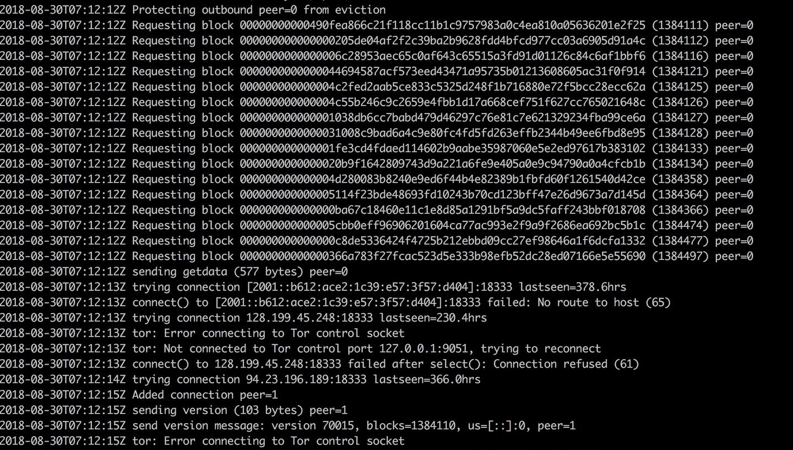
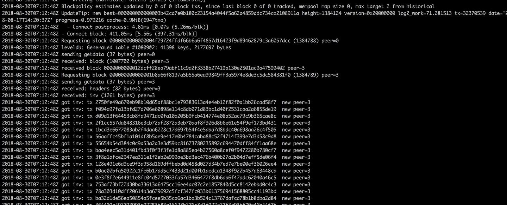

#   如何接入比特币网络以及原理分析

##  1、如何接入比特币网络？

其实接入比特币网络是非常简单的，我说了你一定不信，启动比特币客户端即可：

在命令行终端输入启动命令：`./src/bitcoind -testnet` 

输入之后会有一个和网络同步数据的过程，你会看到：

这个过程需要一点时间，同步数据完成后，即接入了比特币网络。

## 2、启动流程鸟瞰

虽然说一句命令即搞定，但是，这个背后代码运行的逻辑可就不简单咯～

来，我给大家分析一下

当在命令行终端输入启动命令：`./src/bitcoind -testnet` 后，操作系统就会找到这个文件中的 main 函数，开始比特币客户端的启动。

对于所有的c++代码，整个程序都是从main函数开始执行的，bitcoind 的main函数位于 `src/bitcoind.cpp`，代码拉到最后就找到了我们的 main 函数。

main 函数本身没有太多东西，主要是调用3个函数来执行，它们的主要作用是设置环境变量、设置信号处理和启动系统。

具体代码如下：

    int main(int argc, char* argv[])
    {
        SetupEnvironment();
        noui_connect();
        return (AppInit(argc, argv) ? EXIT_SUCCESS : EXIT_FAILURE);
    }

代码说明如下：

1.  `SetupEnvironment` 函数，主要用来设置系统的环境变量，包括：`malloc` 分配内存的行为、Locale、文件路径的本地化设置等。

2.  `noui_connect` 函数，设置连接到 bitcoind 的信号的处理。

3.  `AppInit` 函数，进行系统启动。

下面我们重点讲下 `AppInit` 函数的执行

1.  调用 `SetupServerArgs` 函数，设置系统可接受的所有命令行参数。然后开始解析命令行传递的各种参数。

    系统执行的重要一步就是就设置可以接收的参数，解析用户启动时传递的各种参数，`SetupServerArgs` 函数就是完成这个目的。下面来看这个函数的执行流程。

    -   首先，调用 `CreateBaseChainParams` 函数，生成默认的基本参数，包括：使用的数据目录和监听的端口。根据不同的网络类型，主网络使用 8332 端口和指定目录下的当前目录，测试网络使用 18332 端口和指定目录下的 testnet3 子目录，回归测试网络使用 18443 端口和指定目录下的 regtest 子目录。

            const auto defaultBaseParams = CreateBaseChainParams(CBaseChainParams::MAIN);
            const auto testnetBaseParams = CreateBaseChainParams(CBaseChainParams::TESTNET);
            const auto regtestBaseParams = CreateBaseChainParams(CBaseChainParams::REGTEST);

    -   然后，调用 `CreateChainParams` 函数，生成默认的区块链参数。这个方法也会区分不同的网络。

            const auto defaultChainParams = CreateChainParams(CBaseChainParams::MAIN);
            const auto testnetChainParams = CreateChainParams(CBaseChainParams::TESTNET);
            const auto regtestChainParams = CreateChainParams(CBaseChainParams::REGTEST);

        上面3个对象的定义都在 `chainparams.cpp` 文件中。

    -   接下来，生成并初始化隐藏参数 `hidden_args` 集合。

        -   -h

        -   -help

        -   -dbcrashratio

        -   -forcecompactdb

        -   -allowselfsignedrootcertificates

        -   -choosedatadir

        -   -lang=<lang>

        -   -min

        -   -resetguisettings

        -   -rootcertificates=<file>

        -   -splash

        -   -uiplatform
       
    -   再接下来，设置系统可接收的所有参数及他们的帮助信息。

        除了 `SetupServerArgs` 方法中直接列出的这些之外，还通过下面三种方法设置了一些参数：

        -   通过调用钱包接口（`wallet/init.cpp`）的 `AddWalletOptions` 方法，设置钱包相关的参数；

        -   通过调用 `SetupChainParamsBaseOptions` 方法，设置区块链相关的参数；

        -   通过调用 `AddHiddenArgs` 方法，设置隐藏参数。`hidden_args` 集合除了上面列出的之外，增加了 `-upnp`、`-zmqpubhashblock=<address>`、`-zmqpubhashtx=<address>`、`-zmqpubrawblock=<address>`、`-zmqpubrawtx=<address>`、`-daemon` 等几个。

    **具体有哪些参数，可以参考本文的第三部分：系统可接受的参数**

2.  接下来，检查用户指定命令参数是否正确。

        if (!gArgs.ParseParameters(argc, argv, error)) {
            fprintf(stderr, "Error parsing command line arguments: %s\n", error.c_str());
            return false;
        }

3.  如果传递的是帮助和版本参数，则显示帮助或版本信息，然后退出。

4.  检查数据目录（可指定或默认）是否是存在。如果不存在，则打印错误信息，然后退出。

        if (!fs::is_directory(GetDataDir(false)))
        {
            fprintf(stderr, "Error: Specified data directory \"%s\" does not exist.\n", gArgs.GetArg("-datadir", "").c_str());
            return false;
        }

    在 `GetDataDir` 方法中，根据用户是否在命令行提供 `datadir` 参数来确定使用默认的数据目录还是用户指定的数据目录。

5.  读取并解析配置文件，同时检查指定数据目录是否存在。如果任何一个步骤出错，都打印错误信息，然后退出。

        if (!gArgs.ReadConfigFiles(error, true)) {
            fprintf(stderr, "Error reading configuration file: %s\n", error.c_str());
            return false;
        }

    `ReadConfigFiles` 方法具体处理如下：

    -   首先，调用 `GetArg` 方法，获取配置文件名称，默认为 `bitcoin.conf`。

    -   然后，通过 `GetConfigFile` 方法获取配置文件的绝对路径（方法内部会委托 `AbsPathForConfigVal` 方法进行处理，后者决定根据用户指定的路径或使用默认路径来生成配置文件的绝对路径）。在得到配置文件的绝对路径之后，构造文件输入流，从而读取配置文件 `fs::ifstream stream(GetConfigFile(confPath))`。

    -   在成功构造输入流之后，调用 `ReadConfigStream` 方法开始读取配置文件的内容。

        方法内部按行读取配置文件，并以键值对的形式保存在 `m_config_args` 集合中。

6.  调用 `SelectParams(gArgs.GetChainName())` 函数，生成全局的区块链参数，并设置系统的网络类型。如果有错误，则打印错误，然后退出。

    `gArgs.GetChainName()` 方法会返回当前使用的网络。针对主网络，返回字符串 `main`；测试网络，返回字符串 `test`；回归测试网络，返回字符串 `regtest`。

    `SelectParams` 方法的实现如下所示：

        void SelectParams(const std::string& network)
        {
            SelectBaseParams(network);
            globalChainParams = CreateChainParams(network);
        }

    `SelectBaseParams` 方法会根据指定的网络参数生成 `CBaseChainParams` 对象，并保存在 `globalChainBaseParams` 变量中，并在指定 `gArgs` 对象中保存网络类型（`m_network` 属性）。`CBaseChainParams` 对象中仅保存系统的数据目录和运行的端口，所以称之为基本区块链参数对象。

    `CreateChainParams` 方法会根据不同的网络参数生成 `CChainParams` 类的子对象，可能为以下三种：CMainParams、CTestNetParams、CRegTestParams。`CChainParams` 对象包含了区块链对象的所有重要信息，比如：共识规则、部署状态、检查点、创世区块等。

7.  检查所有命令行参数，如果有错误，则打印错误，并退出。

8.  设置参数 `-server` 默认为真。

        gArgs.SoftSetBoolArg("-server", true);

    bitcoind 守护进程默认 `server` 为真。

9.  调用 `InitLogging` 函数，初始化系统所用日志，并打印系统的版本信息。

    具体代码如下，根据是否指定 `debuglogfile`、`printtoconsole` 等确定日志打印到文件或是控制台。

        void InitLogging()
        {
            g_logger->m_print_to_file = !gArgs.IsArgNegated("-debuglogfile");
            g_logger->m_file_path = AbsPathForConfigVal(gArgs.GetArg("-debuglogfile", DEFAULT_DEBUGLOGFILE));

            LogPrintf("\n\n\n\n\n");

            g_logger->m_print_to_console = gArgs.GetBoolArg("-printtoconsole", !gArgs.GetBoolArg("-daemon", false));
            g_logger->m_log_timestamps = gArgs.GetBoolArg("-logtimestamps", DEFAULT_LOGTIMESTAMPS);
            g_logger->m_log_time_micros = gArgs.GetBoolArg("-logtimemicros", DEFAULT_LOGTIMEMICROS);

            fLogIPs = gArgs.GetBoolArg("-logips", DEFAULT_LOGIPS);

            std::string version_string = FormatFullVersion();

            LogPrintf(PACKAGE_NAME " version %s\n", version_string);
        }

10.  调用 `InitParameterInteraction` 函数，根据参数间的关系，检查所有的交互参数。

11. 调用 `AppInitBasicSetup` 函数，进行基本的设置。如果有错误，则打印错误，然后退出。

    经过前面漫长的检查与设置，终于开始了应用基本的设置。

    具体讲解参见启动过程的第一步。

12. 调用 `AppInitParameterInteraction` 函数，处理参数的交互设置。

    具体讲解参见启动过程的第二、三步。

13. 调用 `AppInitSanityChecks` 函数，处理底层加密函数相关内容。

    具体讲解参见启动过程的第四步。

14. 调用 `AppInitLockDataDirectory` 函数，检查并锁定数据目录。

    方法内部调用 `LockDataDirectory` 方法，锁定数据目录。如果锁定失败，则返回假，否则，返回真。

    锁定数据目录的目的是为了防止多个客户端同时启动。

15. 调用 `AppInitMain` 函数，比特币主要的启动过程。

    具体讲解参见启动过程的第四a 到十三步。

16. 如果应用初始化主函数出错，则调用 `Interrupt` 函数进行中止，否则调用 `WaitForShutdown` 函数等待系统结束。

    `WaitForShutdown` 函数是一个无限循环函数。

##  3、系统可接受的参数

### 常用参数

- ?，显示帮助信息；

- -version，打印版本信息，并退出系统。

-   -assumevalid=hex，如果指定的区块存在区块链中，假定它及其祖先有效并可能跳过其脚本验证。

-   -blocksdir=dir，指定区块链存放的目录。

-   -blocknotify=cmd，指定当主链上的区块改变时执行的命令。

-   -conf=file，指定配置文件的目录，相对于下面指定的数据目录。

-   -datadir=dir，指定数据目录。

-   -dbcache=n，设置数据库缓存大小。

-   -debuglogfile=file，设置调试文件的位置。

-   -feefilter，告诉其他节点通过最小交易费用过滤发送给我们的库存消息。

-   -loadblock=file，在启动时，从外部 blk000??.dat 文件导入区块。

-   -maxmempool=n，指定交易池的最大内存数，单位为兆字节。

-   -maxorphantx=n，指定内存中最大的孤儿交易数量。

-   -mempoolexpiry=n，指定交易池中不跟踪超过指定时间（小时）的交易。

-   -par=n，指定脚本签名的线程数量。

-   -persistmempool，指定是否持久化交易池中的交易，启动时恢复加载。

-   -pid=file，指定进程文件。

-   -prune=n，通过启用旧区块的修剪（删除）来降低存储要求。 这允许调用 `pruneblockchain` RPC 来删除特定块，并且如果提供目标大小，则启用对旧块的自动修剪。 此模式与 `-txindex` 和 `-rescan` 不兼容。

-   -reindex，根据硬盘上的 `blk*.dat` 文件重建区块链状态和区块的索引。

-   -reindex-chainstate，根据当前区块的索引重建区块链的状态。

-   -txindex，维护所有交易的索引，被 `getrawtransaction` RPC 命令调用。

-   -addnode=ip，添加一个节点，并连接它，并保持连接。

-   -banscore=n，断开行为不端的同伴的门槛。

-   -bantime=n，不诚实节点重新连接需要的秒数。

-   -bind=addr，绑定到指定的IP，并始终监听它。

-   -connect=ip，仅仅只连接到指定的节点，如果不是ip而是0，则表示禁止自动连接。

-   -discover，是否发现自己的IP地址。

-   -dns，对于 `-addnode`、`-seednode`、`-connect` 总是使用 DNS 查找。

-   -dnsseed，指定如果已有地址比较少，则进行 DNS 查找来获取对等节点。

-   -enablebip61，允许发送 BIP61 定义的拒绝消息。

-   -externalip=ip，指定自身的外部 IP 地址。

-   -forcednsseed，总是通过 DNS 查找来获取对等节点的地址。

-   -listen，接收外部对等节点的连接。

-   -listenonion，自动创建 Tor 隐藏服务。

-   -maxconnections=n，维护到别的节点的最大连接数。

-   -maxreceivebuffer=n，每个对等节点的最大接收缓存。

-   -maxsendbuffer=n，每个对等节点的最大发送缓存。

-   -onion=ip:port，设置 SOCKS5 代理。

-   -peerbloomfilters，支持布隆过滤器过滤区块和交易。

-   -permitbaremultisig，中继非 P2SH 多重签名。

-   -port=port，指定默认的监听端口。

-   -proxy=ip:port，通过 SOCKS5 代理进行连接。

-   -proxyrandomize，随机化每个代理连接的凭据。 从而使Tor流进行隔离。

-   -seednode=ip，指定一个节点来检索其他的节点，随后就从这个接点进行断开。

-   -torcontrol=ip:port，在 onion 启用的情况下，指定 Tor 控制器使用的端口。

-   -torpassword=pass，Tor 控制器的密码。

-   -whitebind=addr，本节点绑定到这个地址上，白名单中的节点通过这个地址连接到节点。

-   -whitelist=IP address or network，当收到连接请求的时候，如果节点在这个白名单中，就直接中继而不用检查。

-   -checkblocks=n，在启动时要检查多少个区块。

-   -checklevel=n，`checkblocks` 验证区块的程度。

-   -checkblockindex，进行完整的一致性检查，包括：mapBlockIndex、setBlockIndexCandidates、chainActive、mapBlocksUnlinked 等。

-   -checkmempool=n，每多少个交易进行检验。

-   -checkpoints，提供检查点，对已知链的历史不进行检验。

-   -deprecatedrpc=method，不赞成使用的 RPC 方法。

-   -limitancestorcount=n，如果交易池中的祖先交易达到或超过指定的值时，不再接收交易。

-   -limitancestorsize=n，如果交易池中的祖先交易大小达到或超过指定的值时，不再接收交易。

-   -limitdescendantcount=n，如果交易池中祖先交易的后代已经达到或超过指定的值时，不再接收交易。

-   -blockmaxweight=n，设置 BIP141 区块的最大 weight。

-   -blockmintxfee=amt，设置包含在创建区块的交易最小费用。

-   -blockversion=n，重写区块版本号，以测试分叉方案。

-   -rest，允许 REST 请求。

-   -rpcallowip=ip，设置允许 JSON-RPC 连接的地址/来源。

-   -rpcauth=userpw，JSON-RPC 连接的用户名和密码哈希。

-   -rpcbind=addr:port，绑定到指定的地址来监听 JSON-RPC 连接。

-   -rpccookiefile=loc，进行验证的的 cookie 位置。

-   -rpcuser=user，JSON-RPC 连接的用户名。

-   -rpcpassword=pw，JSON-RPC 连接的用户密码。

-   -rpcport=port，JSON-RPC连接监听的端口。

-   -rpcservertimeout=n，HTTP 请求的超时时间。

-   -rpcthreads=n，设置服务 RPC 调用的线程数量。

-   -rpcworkqueue=n，设置服务 RPC 调用的工作队列深度。

-   -server，接受命令行和 JSON-RPC 命令。

-   -debug=category，输入调试信息。如果输出类别（category）不指定默认输出所有调试信息。类别包括：addrman、alert、bench、cmpctblock、coindb、db、http、libevent、lock、mempool、mempoolrej、net、proxy、prune、rand、reindex、rpc、selectcoins、tor、zmq、qt 等。

### 钱包相关的参数

钱包相关的参数通过调用 `AddWalletOptions` 方法，被加入 `gArgs` 中。钱包相关的参数有如下这些：

- -addresstype

- -avoidpartialspends

- -changetype

- -disablewallet

- -discardfee=<amt>

- -fallbackfee=<amt>

  当费用估算数据不足时，将使用的费率。

- -keypool=<n>

- -mintxfee=<amt>

- -paytxfee=<amt>

  交易费用。

- -rescan

  在启动时，扫描区块链

- -salvagewallet

- -spendzeroconfchange

  发送交易时，是否可以花费未确认的变更（交易）。

- -txconfirmtarget=<n>

  如果没有设置交易费用，则应包含足够的费用，以便在平均 n 个区块内打包交易。

- -upgradewallet

- -wallet=<path>

- -walletbroadcast

- -walletdir=<dir>

- -walletnotify=<cmd>

- -walletrbf

  发送交易时，是否启用 full-RBF opt-in。

- -zapwallettxes=<mode>

- -dblogsize=<n>

- -flushwallet

- -privdb

- -walletrejectlongchains

##  4、三种网络的参数

### 4.1、主网络

主网络由类 `CMainParams` 表示。在构造函数中，进行如下的设置：

1.  网络ID `strNetworkID` 为 `main`；

2.  共识参数（`Consensus::Params`）的各个值：

    -   每隔多少个块（`nSubsidyHalvingInterval`）后续比特币的奖励会减半，值为 210000。

        根据创世区块奖励的数量（50），根据等比数列求和公式：$$ 50 * (1 / (1 - 0.5)) * 210000 $$，可计算货币总量为 2100W个比特币。

    -   BIP16Exception

        `0x00000000000002dc756eebf4f49723ed8d30cc28a5f108eb94b1ba88ac4f9c22`

    -   BIP34 激活高度（`BIP34Height`）为 227931。

    -   BIP34 激活哈希`BIP34Hash`

        `0x000000000000024b89b42a942fe0d9fea3bb44ab7bd1b19115dd6a759c0808b8`

    -   BIP65 激活高度 `BIP65Height`

        388381

    -   BIP66 激活高度 `BIP66Height`

        363725

    -   工作量限制`powLimit`

        `00000000ffffffffffffffffffffffffffffffffffffffffffffffffffffffff`。

    -   难度改变的周期 `nPowTargetTimespan`

        2周，`14 * 24 * 60 * 60` 秒

    -   平均出块时间 `nPowTargetSpacing`

        10分钟，`10 * 60`。

    -   改变共识需要的区块数 `nRuleChangeActivationThreshold`

        1916 个区块，即 2016 的 95%

    -   矿工确认窗口 `nMinerConfirmationWindow`

        2016，等于难度改变周期除以平均出块时间。

    -   区块链相关的部署状态，包括：

        -   测试相关的 `DEPLOYMENT_TESTDUMMY`

        -   CSV 软分叉相关的，涉及到 BIP68、BIP112、BIP113

        -   隔离见证相关的，涉及到 BIP141、BIP143、BIP147。

    -   最佳区块链的最小工作量

        `0x0000000000000000000000000000000000000000028822fef1c230963535a90d`

    -   创世区块的哈希

        值为 `CreateGenesisBlock` 方法生成的创世区块的哈希。

3.  设置默认端口 `nDefaultPort`

    8333

4.  达到多少个区块之后进行区块修剪 `nPruneAfterHeight`

    100000

5.  设置 DNS 种子节点 `vSeeds` 集合包含的 DNS 种子

        通过解析 DNS 种子节点，比特币节点启动时可以找到更多的对等节点来进行连接。

6.  `base58Prefixes` 集合中各个前缀

    包括以下几种：

    -   公钥地址

        0

    -   脚本地址

        5

    -   私钥前缀

        128

    -   扩展公钥

        4、136、178、30

    -   扩展私钥

        4、136、173、228

7.  bech32_hrp

    bc

8.  vFixedSeeds

    固定的种子节点

9.  fDefaultConsistencyChecks

    假

10. fRequireStandard

    真

11. fMineBlocksOnDemand

    不进行挖矿

12. checkpointData

13. chainTxData

14. m_fallback_fee_enabled

    禁止回退费用

### 4.2、测试网络

1.  `base58Prefixes` 集合中各个前缀

    包括以下几种：

    -   公钥地址

        111

    -   脚本地址

        196

    -   私钥前缀

        239

    -   扩展公钥

        4、53、135、207

    -   扩展私钥

        4、53、131、148

### 4.3、回归测试网络

1.  `base58Prefixes` 集合中各个前缀

    包括以下几种：

    -   公钥地址

        111

    -   脚本地址

        196

    -   私钥前缀

        239

    -   扩展公钥

        4、53、135、207

    -   扩展私钥

        4、53、131、148
